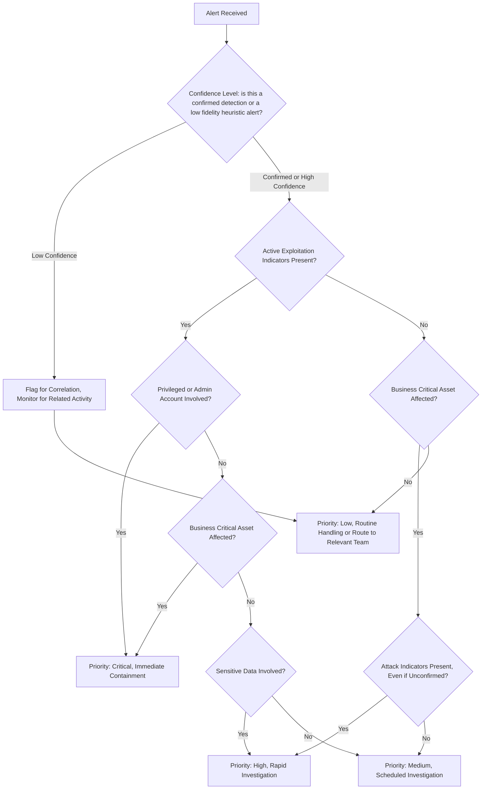

# Alert Prioritisation Model

When five alerts land at once, the order they get worked in matters as much as how each one is individually handled. This document covers a repeatable model for ranking alerts, built on defined criteria rather than on which alert sounds the most alarming.

## Why Instinct Is Not Enough

Under pressure, analysts default to whichever alert sounds worst on the surface. A large outbound data transfer reads as more serious than a handful of failed logins, so it gets worked first. But if that transfer is going to an approved backup destination and the failed logins are hitting a domain admin account from an unfamiliar location, the actual risk ranking is the reverse. A structured model exists specifically to catch cases like this, where the alert that sounds quietest is the one that needs attention first.

## The Criteria

- **Confidence level**, is this a confirmed detection or a low fidelity heuristic that needs more context before it means anything
- **Active exploitation indicators**, is there direct evidence of an attacker taking action, not just a suspicious pattern
- **Asset criticality**, does this affect a system the business genuinely cannot function without
- **User privilege level**, is a standard account involved, or one with administrative or domain level access
- **Data sensitivity**, is regulated, financial, or otherwise sensitive data involved
- **Business impact**, beyond the technical severity, what does this actually cost the organisation if it plays out fully

## Working Through the Five Example Alerts

**Leaked credentials discovered.** Confidence level depends on the source, if this comes from a verified breach dataset rather than a speculative scan, confidence is high. The key question is whether there is evidence the credentials are already being used. If there is, this becomes a confirmed active exploitation case and moves straight to critical, particularly if the account has any elevated privilege. If there is no evidence of use yet, it is high priority rather than critical, the account needs to be reset and monitored, but there is no confirmed active compromise.

**Multiple failed login attempts.** On its own, this is common and often low priority, automated scanning generates this constantly. The ranking changes entirely based on the account involved and the pattern. Failed logins against a standard user account from a single location is routine. Failed logins against a privileged account, or a pattern suggesting credential stuffing across many accounts from the same source, raises this to at least high priority because it suggests deliberate targeting rather than background noise.

**Large outbound data transfer.** This needs asset and data context before it can be ranked at all. A transfer to a known, approved destination such as a backup service is low priority, in fact it may not be a genuine alert at all once context is applied. A transfer to an unfamiliar external destination, particularly involving a system known to hold sensitive data, is high to critical depending on whether there is any other indicator suggesting this is not a legitimate business process.

**Suspicious PowerShell execution.** This depends heavily on what the script is actually doing, which is why evidence collection matters before ranking. Execution that matches a known administrative task on a standard endpoint is low priority. Execution involving encoded commands, unusual parent processes, or activity on a business critical server pushes this toward critical, since this is one of the most common patterns for both initial access and lateral movement.

**Network outage.** This is the one alert type here that may not be a security incident at all. If there is no security relevant context, no correlated alert, no unusual activity preceding it, this is routed to infrastructure rather than treated as a SOC priority. If it correlates with any other alert on this list, particularly containment actions already in progress elsewhere, it may actually be a symptom of an ongoing incident rather than an unrelated fault, and gets re-evaluated accordingly.

The pattern across all five is the same: the label on an alert tells you almost nothing on its own. Priority comes from the context around it, and that context has to be actively checked rather than assumed. A worked example of exactly this, where a transfer alert and an outage alert turn out to be connected, is in `examples/sample-alerts.md` and `examples/triage-notes.md`.

The raw source for this diagram is available at `architecture/alert-decision-tree.mmd`.
