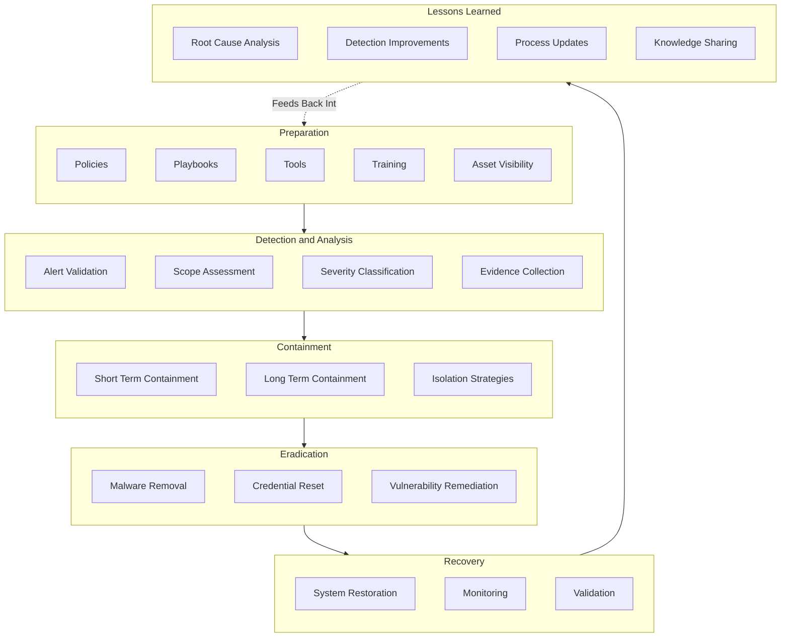

# Incident Response Lifecycle

This document covers what happens once an alert has been formally declared an incident, following the phases used in the SANS and NIST incident response models.

## Preparation

Preparation happens before any incident occurs and determines how well every later phase goes. It covers documented policies for what counts as an incident and who has authority to declare one, playbooks for common incident types so the response is not being improvised from scratch, the tools needed to actually investigate and contain (EDR access, log query access, network isolation capability), training so analysts know how to use those tools under pressure, and asset visibility, because you cannot contain or assess the impact on a system you do not know exists.

## Detection and Analysis

This phase starts once an alert has already made it through triage and escalation from the SIEM and SOAR workflow. Alert validation confirms the activity is genuinely occurring and not an artefact of a logging error or misconfigured rule. Scope assessment establishes how far the activity has spread, one host, or a lateral movement path across several. Severity classification sets the priority level for response, and evidence collection preserves logs, memory captures, and file artefacts before they are lost or overwritten, which matters both for the response itself and for any later review.

## Containment

Containment is split into two distinct decisions, not one action.

**Short term containment** is the immediate action to stop the incident from getting worse, isolating a host from the network, disabling a compromised account, or blocking a malicious indicator at the firewall. It is deliberately fast and does not need to be the permanent fix.

**Long term containment** is the more considered decision about how to remediate the actual access path that allowed the compromise, patching a vulnerability, rebuilding a host from a known good image rather than just cleaning it, or restructuring account permissions.

**Isolation strategies** cover the practical mechanics of both, network segmentation, disabling remote access, or pulling a system entirely offline, chosen based on how much disruption the business can tolerate against how much risk leaving the system connected represents.

## Eradication

Removing the actual threat: malware removal, credential resets for any account that may have been compromised or used during the incident, and vulnerability remediation so the same entry point cannot be used again.

## Recovery

System restoration brings affected systems back into production, monitoring is increased on those systems specifically to catch any sign of recurrence, and validation confirms the environment is genuinely clean before the incident is considered closed rather than just quiet.

## Lessons Learned

Root cause analysis identifies not just what happened but why it was possible in the first place. Detection improvements turn that root cause into a specific update to correlation rules or analytics so the same activity is caught earlier next time. Process updates capture anything about the response itself that should change, a playbook that did not cover this scenario, an escalation that took too long. Knowledge sharing makes sure this is not just documented but actually communicated to the rest of the SOC, so the next analyst who sees something similar recognises it faster.

The raw source for this diagram is available at `architecture/incident-response.mmd`.
