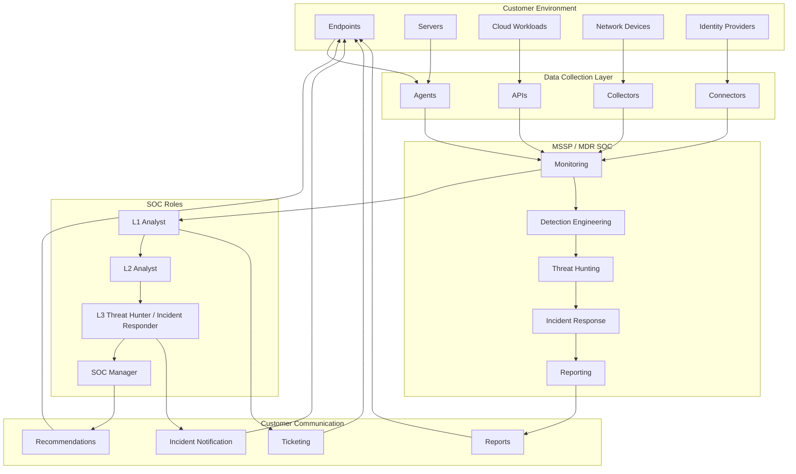

# MDR and MXDR Service Model

Everything covered in `SIEM-SOAR-Workflow.md` describes what happens technically once data reaches a SOC. This document covers how that SOC actually gets built as a service, which is how most organisations without their own dedicated security team access this capability in practice, through a managed detection and response provider.

## Why This Matters as a Service Model, Not Just an Architecture

It is easy to draw an MDR setup as a purely technical diagram, data goes in, alerts come out. That misses most of what actually makes the service work. A customer paying for MDR is not just buying detection coverage, they are buying a defined relationship: what gets monitored, who reviews it, how quickly they are told when something is wrong, and what they are told to do about it. The swimlane structure below reflects that relationship rather than just the data flow.

## Customer Environment

This is everything the customer owns and operates: endpoints, servers, cloud workloads, network devices, and identity providers. The MDR provider does not own or directly control any of this, which shapes everything downstream, response actions have to be requested or automated through agreed channels rather than assumed.

## Data Collection Layer

Telemetry reaches the provider through agents installed on endpoints and servers, collectors positioned to capture network and log data, APIs that pull data directly from cloud platforms, and connectors built for specific identity or SaaS platforms. This layer is where scope is actually defined in practice, if a system is not feeding data through one of these paths, it is not covered by the service, regardless of what the contract says in general terms.

## MSSP or MDR SOC

This is the operational core: continuous monitoring, detection engineering to keep correlation rules and analytics current, threat hunting to look for activity that automated detection missed, incident response when something is confirmed, and reporting back to the customer.

## SOC Roles

- **L1 Analyst**, first review of incoming alerts, initial triage against known patterns
- **L2 Analyst**, deeper investigation of alerts that were not closed at L1
- **L3 Threat Hunter or Incident Responder**, scope determination, formal incident declaration, and hands on response
- **SOC Manager**, oversight of the team, escalation of decisions that affect the customer relationship, and quality control over how alerts are being handled

This mirrors the L1 to L3 structure in the SIEM and SOAR workflow directly, the same escalation path that exists inside a single alert's lifecycle is also the structure of the team handling it. Full role detail is in `SOC-Roles-and-Responsibilities.md`.

## Customer Communication

A ticketing system for tracking individual alerts and their status, direct incident notification when something serious is confirmed, regular reports summarising activity and detection coverage, and recommendations for closing gaps the provider has identified in the customer's environment. This lane exists because detection without communication is not a service, it is just a black box the customer is paying for and has to trust blindly.

The raw source for this diagram is available at `architecture/mdr-service-model.mmd`.
