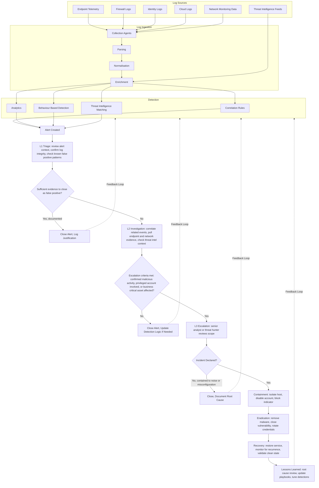

# SIEM and SOAR Alert to Resolution Workflow

This document covers the complete path an alert takes, from the log source that generated the underlying data through to resolution and the feedback loop back into detection tuning.

## Log Sources

Detection is only as good as the data feeding it. This workflow assumes six categories of log source:

- **Endpoint telemetry**, process execution, file activity, and behavioural data from EDR agents
- **Firewall logs**, allowed and blocked connections, port and protocol activity
- **Identity logs**, authentication attempts, privilege changes, conditional access decisions
- **Cloud logs**, activity across cloud platforms, resource changes, access to storage and workloads
- **Network monitoring data**, traffic patterns, DNS queries, unusual volumes or destinations
- **Threat intelligence feeds**, known indicators of compromise, malicious IPs, domains, and file hashes

## Log Ingestion

Raw log data is not directly usable for detection. It passes through four stages before it reaches a correlation engine:

1. **Collection agents** pull or receive logs from each source
2. **Parsing** breaks raw log entries into structured fields
3. **Normalisation** maps those fields into a consistent schema so that, for example, a source IP field means the same thing whether it came from a firewall or a cloud platform
4. **Enrichment** adds context, resolving an IP to a geolocation, matching a hash against threat intelligence, or tagging an asset with its business criticality

## Detection

Once normalised and enriched, log data is evaluated by four detection methods, any of which can independently generate an alert:

- **Correlation rules**, pattern matches across multiple log sources within a defined time window
- **Analytics**, statistical or volume based anomalies
- **Behaviour based detection**, deviations from an established baseline for a user or system
- **Threat intelligence matching**, direct hits against known malicious indicators

## Alert Lifecycle

### L1 Triage

The analyst reviews the alert in context: what triggered it, what the raw evidence looks like, and whether it matches a known and already documented false positive pattern. The required evidence at this stage is the alert itself, the raw log entries that generated it, and any existing documentation for that alert type. The decision point is whether there is enough evidence to close the alert immediately with a documented justification, or whether it needs deeper investigation.

### L2 Investigation

If the alert is not closed at L1, an L2 analyst correlates it against related events across other log sources, pulls additional endpoint or network evidence, and checks it against threat intelligence context. The escalation criteria at this stage are specific: confirmed malicious activity, a privileged account involved, or a business critical asset affected. If none of those apply, the alert is closed and, where relevant, the detection logic is updated to reduce future noise. If any of them apply, it goes to L3.

### L3 Escalation and Incident Declaration

A senior analyst or threat hunter reviews the full scope of the activity and makes the formal call on whether this is an incident. If it is contained to noise, misconfiguration, or an already known and accepted risk, it is closed with the root cause documented. If it is confirmed, it becomes a formal incident and moves into containment.

### Containment, Eradication and Recovery

These stages are covered in detail in `Incident-Response-Lifecycle.md`. In this workflow they represent the point where the alert has fully transitioned from a detection problem into an incident response problem.

### Lessons Learned and the Tuning Feedback Loop

Every path through this workflow, whether an alert is closed at L1, closed at L2, closed without a declared incident at L3, or resolved through the full incident response process, feeds back into detection. Closed alerts that follow a repeatable pattern indicate a detection rule that needs tuning to reduce noise. Escalated alerts that turn out not to be incidents indicate the same thing from the other direction. Confirmed incidents indicate a gap that needs a new or improved detection rule so the same activity is caught faster next time. This feedback loop is what stops a SOC's detection coverage from staying static while the threat landscape moves on.

The raw source for this diagram is available at `architecture/siem-soar-workflow.mmd`.
